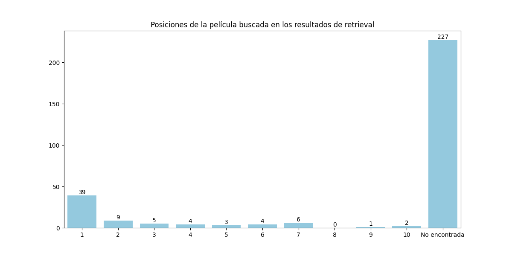
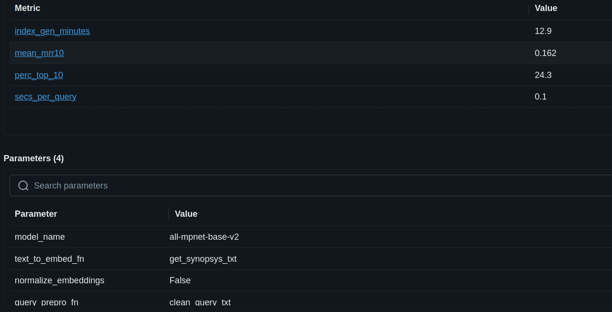
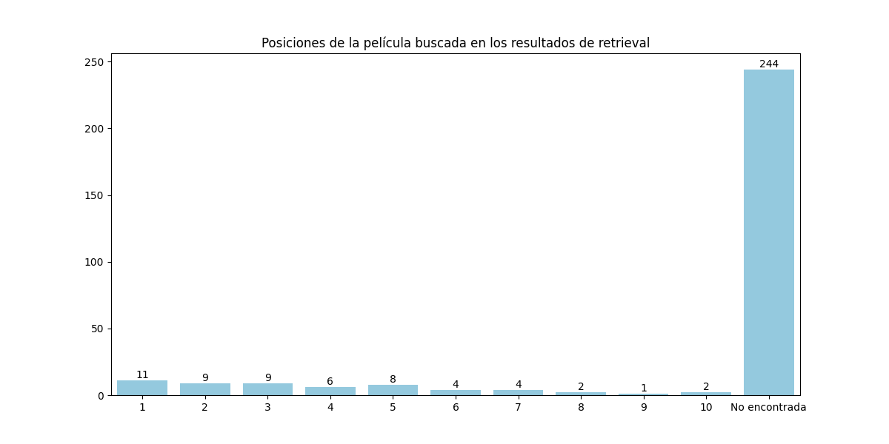

# Movie recommendation System using RAG
This repository contains a Movie Recommendation System that leverages Retrieval-Augmented Generation (RAG) techniques to provide personalized movie recommendations based on user preferences and historical data.

## Dependencies
- Python 3.13
- UV as package and project manager
- LangChain for building the RAG pipeline
- FAISS as Vector database for efficient similarity search (CPU mode but it could be changed to GPU mode if available, modifying the pyproject dependency).
- UMAP for dimensionality reduction (a fork was created to upgrade the library to be compatible with Python 3.13).
- Matplotlib and Seaborn for data visualization.
- Other dependencies are listed in the `pyproject.toml` file.

> Conda environment was provided in the bootcamp, but it wasn't used. The instructions are provided in the INSTRUCTIONS.md file if needed.

## Models
Two options are available for generating embeddings:
- all-mpnet-base-v2 from Sentence Transformers for generating embeddings (selected by default for better accuracy).
- all-MiniLM-L6-v2 from Sentence Transformers for generating embeddings (5x times faster but less accurate).

## Testing
Inside the folder `retrieval/analysis` there are some notebooks to analyze the performance of the system with different configurations:
- Sandbox is used to download the embedding models and to create the FAISS vector database.
- Embeddings loads the FAISS vector database and tests the embedding models performance, first reducing the dimensionality with UMAP and then plotting the results.

> Using vscode the two notebooks can be run as Python files directly.

## Running the Movie Recommendation System
- Run the following command to start mlflow server and the project:
```bash
make start-movie-recommender
```

Results can be seen in the mlflow UI at `http://localhost:8080/#/experiments`

> If the test notebooks have been run before, the `retrieval/.cache` folder has to be deleted.

## Exercise
- The function `clean_query_txt_v2` in the file `retrieval/retrieval_pipeline_utils.py` has been modified to improve the text preprocessing for Spanish queries. The changes include adapting the stop words to Spanish and adding lemmatization using spaCy with a Spanish lemmatizer.
- The function `process_movie_info` has been added to the file `retrieval/indexing_pipeline_utils.py` to create a comprehensive text representation of movie information for indexing purposes.
- The default embedding model has been changed to `all-mpnet-base-v2` in the `retrieval/config.py` file for better accuracy in recommendations.
- UV has been set as the package and project manager, and a `pyproject.toml` file has been created to manage dependencies and project configuration.
- A Makefile has been added to facilitate common tasks such as setting up the environment and running the movie recommendation system.

> Lemmatization rules requires executing `uv run python -m spacy_spanish_lemmatizer download wiki` and `uv run python -m spacy download es_core_news_sm` before running the project for the first time.

## Results
- First try is using the embedding model `all-mpnet-base-v2` and default preprocessing.





> It returns a mmr10 of 0.16 which is really low due to the lack of preprocessing for Spanish queries and the information returned of the movies being quite limited (only overview). And we can see in the rank distribution thatonly 24.30 % of the relevant documents are found in the top 10 results.

- Second try is using the embedding model `all-mpnet-base-v2` and the new preprocessing for Spanish queries.




> It returns a mmr10 of 0.078 and rank distribution of 18.7 % of relevant documents found in the top 10 results. The performance has decreased a bit, probably due to the fact that the embedding model is not fine-tuned for Spanish and the information added for each movie is not very relevant (mainly genres and release date).

- Third try is like the previous one but not doing lemmatization in the preprocessing. It increases the mmr10 from 0.078 to 0.086 and rank distribution from 18.7 % to 19%. Moving from the custom spanish lemmatizer to spacy default one didn't improve the results either (similar to second try). So we will disable lemmatization in the preprocessing.

- Fourth try is using the same model but removing also stop words in Spanish. It keeps the same mmr10 of 0.086 but decreases the rank distribution from 19% to 16.7%. So we will keep stop words in the preprocessing.

- Fifth try is using the same model but going back to only synposis as movie information. It keeps the same mmr10 of 0.086 and rank distribution. So the reason we lost mmr10 since the first try is mainly due to the preprocessing for Spanish queries.

- Sixth try is using the same model but commenting out special characters removal in the preprocessing. It increases the mmr10 from 0.086 to 0.116 and rank distribution from 19% to 20.7%. Commenting out space removal or not lowering the query didn't change the results. So we will keep special characters in the preprocessing.

- Seventh try is using the same model but not lowercasing the text in the preprocessing. It decreases the mmr10 from 0.116 to 0.105 but increases rank distribution from 20.7% to 22%. So we will keep lowercasing in the preprocessing.